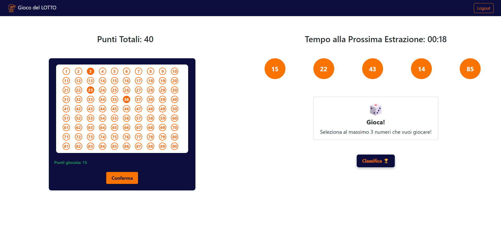
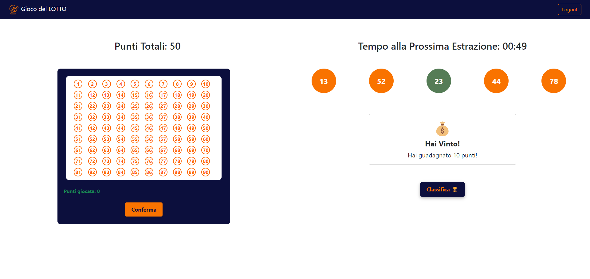

[](https://classroom.github.com/a/HF0PzDJs)
# Exam #3: "Lotto Instantaneo"
## Student: s328782 SCAVONE ALESSANDRO 

## React Client Application Routes

- Route `/`: home page, where non-logged users can read the game rules or log in.
- Route `/login`: login page.
- Route `/play`: playground page, where the user can place bets and see the extractions results in real-time.
- Route `/leaderboard`: page where are shown the best 3 players based on the total amount of points.
- Route `*`: common route for requested non-existant pages.


## API Server

### Draws Management

#### __Get the Last Draw__

HTTP Method: `GET` URL: `/api/draws/lastDraw`.

Description: retrieve the last draw made by the server and saved on the database.

Response: `200 OK` (success), `204 Empty Response` (there aren't draws), `500 Internal Server Error` (database error), `401 Unauthorized User` (user not authorized).

Response Body:
``` json
{
    "id": 1,
    "n1": 1,
    "n2": 2,
    "n3": 3,
    "n4": 4,
    "n5": 5,
    "timeStamp": "2024-08-26,20:08:30"  //YYYY-MM-DD,HH-mm-ss
}
```


### Bets Management

#### __Add a Bet__

HTTP Method: `POST` URL: `/api/bets`.

Description: add a new bet for a given user and a given draw.

Request Body:
``` json
{
    "userId": 1,
    "drawId": 1,
    "n1": 1,
    "n2": 2,
    "n3": 3,
    "usedPoints": 15,
    "wonPoints": -1
}
```

Response: `200 OK` (success), `500 Internal Server Error` (database error), `422 Unprocessable Entity` (invalid input), `409 Conflict` (resource already present), `404 Not Found` (user not found), `401 Unauthorized User` (user not authorized).

Response Body: _None_.


#### __Update a Bet__

HTTP Method: `PUT` URL: `/api/bets/:id`.

Description: update a bet given its id.

Request Body:
``` json
{
    "n1": 11,
    "n2": 22,
    "n3": 33,
    "usedPoints": 15
}
```

Response: `200 OK` (success), `500 Internal Server Error` (database error), `422 Unprocessable Entity` (invalid input), `404 Not Found` (bet not found), `401 Unauthorized User` (user not authorized).

Response Body: _None_.


#### __Get a Bet__

HTTP Method: `GET` URL: `/api/users/:userId/bets/:drawId`.

Description: update a bet given its id.

Response: `200 OK` (success), `500 Internal Server Error` (database error), `422 Unprocessable Entity` (invalid input), `401 Unauthorized User` (user not authorized).

Response Body: _None_.


### Sessions Management

#### __Login__

HTTP Method: `POST` URL: `/api/sessions`.

Description: authenticate the user who is trying to login.

Request Body:
``` json
{
    "username": "mario.rossi@polito.it",
    "password": "provaprova"
}
```

Response: `201 Created` (fulfilled request), `401 Unauthorized User` (login error), `500 Internal Server Error` (generic error).

Response Body:
``` json
{
    "id": 1,
    "username": "mario.rossi@polito.it",
    "name": "Mario"
}
```

#### __Check if a User is Logged In__

HTTP Method: `GET` URL: `/api/sessions/current`.

Description: check if current user is logged in and get his data.

Response: `200 OK` (success), `401 Unauthorized User` (login error), `500 Internal Server Error` (generic error).

Response Body:
``` json
{
    "id": 1,
    "username": "mario.rossi@polito.it",
    "name": "Mario"
}
``` 

#### __Logout__

HTTP Method: `DELETE` URL: `/api/sessions/current`.

Description: logout current user.

Response: `200 OK` (success), `401 Unauthorized User` (login failed), `500 Internal Server Error` (generic error).

Response Body: _None_.


### Users Management

#### __Get the Points of a User__

HTTP Method: `GET` URL: `/api/users/:id/points`.

Description: retrieve the points of the user identified by id. 

Response: `200 OK` (success), `500 Internal Server Error` (database error), `401 Unauthorized User` (user not authorized), `404 Not Found` (user not found), `422 Unprocessable Entity` (invalid input).

Response Body:
``` json
    100
```

#### __Update the Points of a User__

HTTP Method: `PUT` URL: `/api/users/:id/points`.

Description: update the points of a user.

Request Body:
``` json
{
    "points": 90
}
```

Response: `200 OK` (success), `500 Internal Server Error` (database error), `422 Unprocessable Entity` (invalid input), `404 Not Found` (user not found), `401 Unauthorized User` (user not authorized).

Response Body: _None_.

#### __Get the Top 3 Users__

HTTP Method: `GET` URL: `/api/users/top3`.

Description: retrieve the best 3 users based on points.

Response: `200 OK` (success), `500 Internal Server Error` (database error), `401 Unauthorized User` (user not authorized).

Response Body:
``` json
[
    {
        "email": "mario.verdi@polito.it",
        "points": 95
    },
    {
        "email": "mario.rossi@polito.it",
        "points": 80
    },
    {
        "email": "mario.bianchi@polito.it",
        "points": 60
    }
]
```

### Poll Management

#### __Poll the Server for Obtaining the Extraction__

HTTP Method: `GET` URL: `/api/poll`.

Description: adds the client to the list of clients in the server, removing them when they disconnect. Then returns the extractions when they're made by the server.

Response: `200 OK` (success), `401 Unauthorized User` (user not authorized).

Response Body:
``` json
{
    "numbers": [1, 2, 3, 4, 5],
    "drawId": 1
}
```

#### __Get the Remaining Time__

HTTP Method: `GET` URL: `/api/time-remaining`.

Description: retrieve the remaining time until next extraction.

Response: `200 OK` (success).

Response Body:
``` json
{ 
    "remainingTime": 120000,
    "timestamp": 1726591629023
}
```


## Database Tables

- Table `users` - contains the users information for the log in and also the remaining points for the user.
- Table `draws` - contains the results of each draw made (the numbers extracted).
- Table `bets` - contains the bets made by the users for each draw, saving also the points used and the score for each bet.

## Main React Components

- `NavHeader` (in `NavHeader.jsx`): depending on the login state shows the option to log in or log out and shows also the icon and title of the web-application.
- `LoginForm` (in `Auth.jsx`): shows the Form to perform the login of the user, requiring the user's credentials (email and password).
- `Home` (in `Home.jsx`): home page containing the game rules and a Carousel that shows how to play.
- `Extraction` (in `Extraction.jsx`): shows the results of the extraction in 5 numbered balls. In the 5 seconds before the extraction, the balls are animated showing numbers changing rapidly. After the extraction it shows the correctly guessed numbers if any.
- `Leaderboard` (in `Leaderboard.jsx`): shows the leaderboard containing the best 3 players ordered by descending total number of points.
- `NumbersGrid` (in `NumbersGrid.jsx`): shows the grid with the number inside it, the points for the currently selected numbers and the confirm button.
- `Results` (in `Results.jsx`): shows the earned points if any with a dedicated message for the different possible cases.
- `HomePageLayout` (in `PageLayout.jsx`): layout of the page containing the Home component.
- `PlayPageLayout` (in `PageLayout.jsx`): layout of the page where the users can play and receive the results.
- `LeaderboardPageLayout` (in `PageLayout.jsx`): layout of the leaderboard page containing the Leaderboard Component.
- `NotFoundLayout` (in `PageLayout.jsx`): layout of the not found page.


## Screenshot





## Users Credentials

- mario.rossi@polito.it, provaprova
- mario.bianchi@polito.it, provaprova
- mario.verdi@polito.it, provaprova